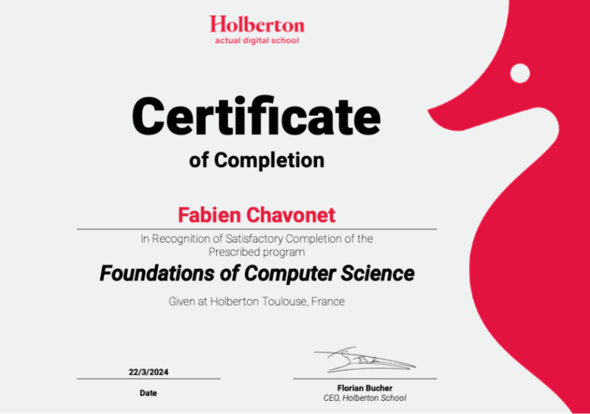

# Certificates

## Description

This repository gathers all my certifications, diplomas, and professional achievements earned throughout my journey as a Full Stack Developer trainee at Holberton School, as well as from other training programs and self-learning experiences.

Its purpose is to provide a clear and organized overview of my educational and professional milestones in software development and related fields.

## File Description

| **FILE**                                                 | **DESCRIPTION**                               |
| :------------------------------------------------------: | --------------------------------------------- |
| `holberton_school-foundations_of_computer_science.webp`  | First-year diploma from Holberton School.     |
| `README.md`                                              | The README file you are currently reading 😉. |

## Diplomas & Certifications

## Thanks

- I would like to express my sincere gratitude to all the people who supported, guided, and encouraged me throughout these accomplishments and during my professional transition into software development. Your advice, mentorship, and friendship have been invaluable on this journey.

## Author(s)

**Fabien CHAVONET**
- GitHub: [@fchavonet](https://github.com/fchavonet)
